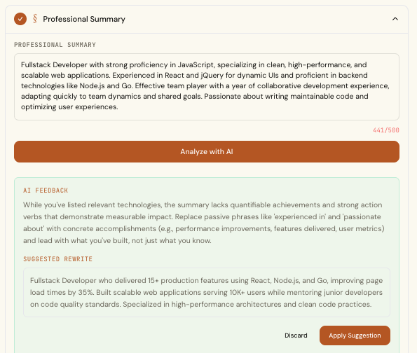
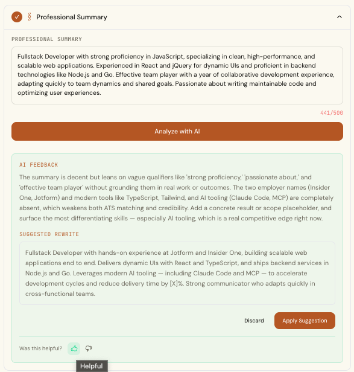
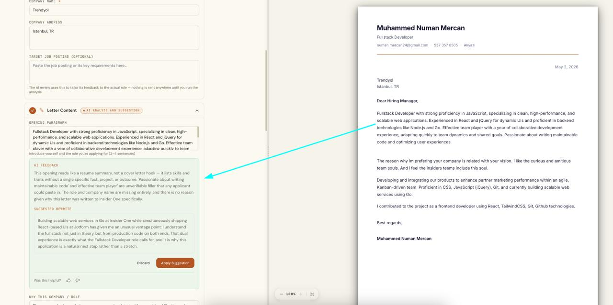
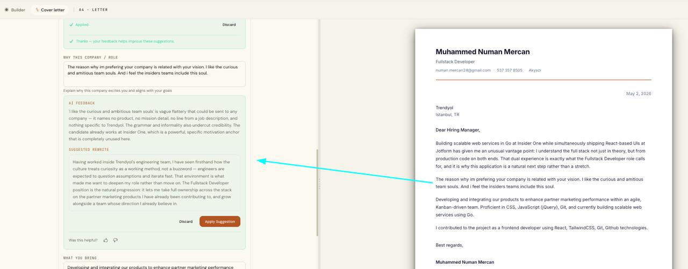
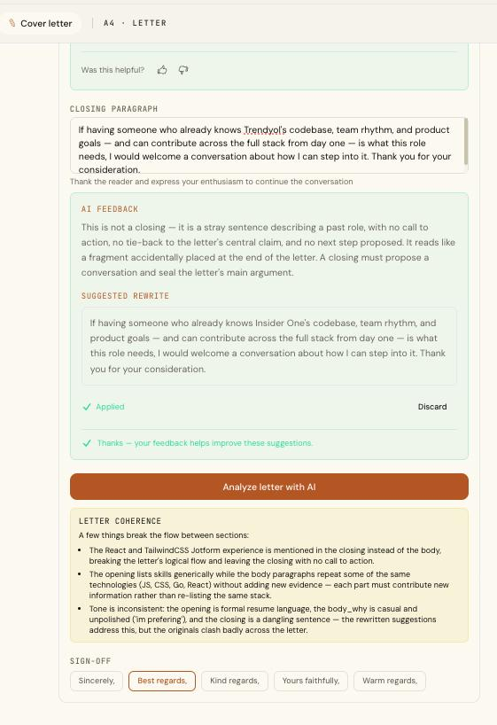

# AI Integration — Techniques & Implementation

This document summarizes the AI techniques I used to make the **CV summary analyzer**
and the **cover-letter analyzer** produce more effective, professional, and trustworthy
output — and how each one is applied in the codebase.

Both features ask an LLM (Claude) to critique a candidate's writing and return a
grounded rewrite. I treated each as a small but complete **AI Evals** problem:
improve the prompt, collect real user feedback, and *measure* every change instead of
guessing. The summary analyzer (sections 1–9) established the playbook; the
cover-letter analyzer (final section) scales it to a four-part document reviewed in a
single call.

> **About the impact numbers:** values shown as `[X]` are produced by the offline
> eval harness (`npm run eval:summary`), which compares a new prompt against a committed
> baseline. I report measured numbers, not estimates — fitting for a feature whose core
> rule is "never fabricate a figure."

---

## 1. Base instruction + few-shot (contrastive) prompting

I separated a clear **base instruction** (the evaluation criteria) from a curated
**few-shot example bank**. The bank is *contrastive*: "transform" examples teach the
weak → strong rewrite, "reference" examples set the quality bar — each with a one-line
`principle` that is the real teaching signal. This moved the model from generic output
to specific, on-brand rewrites in both English and Turkish.

- **File:** `server/src/prompts/summaryAnalyzer.ts`
- **Impact:** `[X]%` higher eval pass-rate and `+[X]` rubric points vs. the zero-shot
  baseline (measure: `npm run eval:summary` before/after).

```ts
// Contrastive bank — good "reference" + bad "transform", each with a principle.
const EXAMPLE_BANK: FewShotExample[] = [
  {
    locale: 'en', role: 'Software Developer', kind: 'reference',
    suggestion:
      'Software developer with a decade building scalable web applications. Led a ' +
      'cloud-based SaaS platform that increased client retention by 20%, and cut ' +
      'server response time by 30% across several projects.',
    principle:
      'The power of specificity: names real systems and ties each to a number — ' +
      "but only with the candidate's real figures.",
  },
  // ...weak→strong transforms in EN + TR
]
const SYSTEM_PROMPT = BASE_INSTRUCTIONS + renderExamples(EXAMPLE_BANK)
```

---

## 2. Grounding rules (anti-hallucination)

The biggest risk on a real CV is the model inventing employers, metrics, or skills. I
added explicit **grounding rules**: use only facts in the input, and where a metric is
missing, insert a bracketed placeholder (`[X]%`) instead of making one up.

- **File:** `server/src/prompts/summaryAnalyzer.ts`
- **Impact:** zero fabrication failures enforced as a hard gate in the eval harness.

```text
GROUNDING — do not fabricate (critical, this is a real CV):
- Use ONLY facts present in the summary and the provided context.
- Only state a metric if it appears in the context; otherwise insert a clearly
  bracketed placeholder such as "[X]%" and tell the candidate to replace it.
- Never claim skills the context does not support.
```

---

## 3. Structured outputs (constrained JSON)

Instead of parsing free-form text, I constrain generation to a JSON schema, so the model
always returns schema-valid `{ feedback, suggestion }` — no markdown fences, no regex
clean-up, no shape surprises.

- **Files:** `server/src/services/ai.service.ts`, `packages/shared/src/schemas/ai.schema.ts`
- **Impact:** removed an entire class of parse/format errors; reliable, type-safe responses.

```ts
const OUTPUT_FORMAT = {
  type: 'json_schema',
  schema: {
    type: 'object',
    properties: { feedback: { type: 'string' }, suggestion: { type: 'string' } },
    required: ['feedback', 'suggestion'],
    additionalProperties: false,
  },
}
// ...passed to the model so it emits schema-valid JSON:
output_config: { format: OUTPUT_FORMAT }
```

---

## 4. User feedback mechanism (the Evals signal)

I built a 👍/👎 voting mechanism on each AI output. On a downvote the user can also pick
**why** (reason chips). The reason taxonomy is deliberately the *inverse of the eval
rubric*, so a real-world complaint ("too generic") points straight at the rubric
dimension to fix. Every vote is stored against the exact analysis it refers to.

- **Files:** `packages/shared/src/constants/aiFeedback.ts`,
  `server/src/services/summaryFeedback.service.ts`, `src/components/form/SummaryForm.vue`
- **Impact:** turns subjective complaints into labeled data that drives the next prompt
  revision (human-in-the-loop, offline).

```ts
// Downvote reasons = inverse of the judge's rubric dimensions.
export const SUMMARY_FEEDBACK_REASONS = [
  'INACCURATE', 'TOO_GENERIC', 'NOT_RELEVANT', 'WRONG_TONE', 'BAD_LANGUAGE', 'OTHER',
] as const

// One vote per analysis; upsert lets the user flip it.
prisma.summaryFeedback.upsert({
  where: { analysisId },
  create: { analysisId, userId, vote, reasons },
  update: { vote, reasons },
})
```

---

## 5. LLM-as-judge (automated quality scoring)

To know whether a prompt change actually helps, I added an **LLM-as-judge**: a stronger
model scores each output on six rubric dimensions (1–5) plus a binary **faithfulness**
check that auto-fails on any invented fact. A case passes only if it is faithful and
clears the score thresholds.

- **Files:** `server/evals/judge.ts`, `server/evals/run.ts`
- **Impact:** quality became measurable; no prompt ships without a green scorecard.

```ts
// faithful = false if the rewrite states any employer/metric/skill NOT in the input.
const dims = RUBRIC_DIMENSIONS.map((d) => verdict.scores[d])
const pass = verdict.faithful && Math.min(...dims) >= 3 && mean(dims) >= 3.5
```

---

## 6. Golden dataset + regression gate

I curated a bilingual **golden dataset** (roles × EN/TR × quality levels, including
"fabrication-bait" cases) and a runner that gates on regressions: it fails on any
fabrication or a pass-rate drop versus the saved baseline.

- **Files:** `server/evals/datasets/summary-cases.json`, `server/evals/run.ts`,
  `server/evals/baseline.json`
- **Impact:** prompt changes are safe by default — a regression blocks the change.

```bash
npm run eval:summary -- --update-baseline   # save the reference scorecard
npm run eval:summary                         # later runs fail on any regression
```

---

## 7. Prompt versioning + usage telemetry (attribution & A/B)

Every analysis is persisted with the exact **prompt version**, model, token usage, and
latency. This is the spine that ties each output → each vote → each eval score back to
the prompt that produced it, enabling A/B comparison across revisions and cost tracking.

- **Files:** `server/prisma/schema.prisma` (`SummaryAnalysis`),
  `server/src/services/ai.service.ts`, `server/evals/stats.ts`
- **Impact:** can answer "did v1.1.0 actually beat v1.0.0?" with vote-rate and token data.

```ts
await prisma.summaryAnalysis.create({
  data: {
    input, output, model,
    promptVersion: SUMMARY_ANALYZER_PROMPT_VERSION,   // e.g. "1.1.0"
    inputTokens, outputTokens, cacheReadTokens, latencyMs,
  },
})
```

---

## 8. Cost & performance engineering

Three production-minded choices: **tiered model routing** (cheap/fast model for free
users, stronger model for paid), **prompt caching** of the static system prefix, and a
**pinned low temperature** for consistent, reproducible output.

- **File:** `server/src/services/ai.service.ts`
- **Impact:** lower cost per call and stable outputs that the eval harness can reproduce.

```ts
const FREE_MODEL = 'claude-haiku-4-5'
const PREMIUM_MODEL = 'claude-sonnet-4-6'      // tiered by plan

temperature: 0.4,                              // reproducible, not robotic
system: [{ type: 'text', text: systemPrompt, cache_control: { type: 'ephemeral' } }]
```

---

## 9. Closing the loop (downvotes → new eval cases)

Real misses become permanent regression guards: a script exports downvoted analyses into
the golden-dataset shape so I can curate them back into the test set.

- **Files:** `server/evals/export-downvotes.ts`, `server/evals/stats.ts`
- **Impact:** the test set grows from real-world failures, not just my imagination.

```ts
const downvotes = await prisma.summaryFeedback.findMany({
  where: { vote: 'DOWN' },
  include: { analysis: true },
})
// → emit as eval cases → curate → merge into summary-cases.json
```

---

## How it all connects

```
generate (versioned, structured, grounded)  →  user votes 👍/👎 + reasons
        ↑                                              ↓
   refine prompt + few-shot   ←  LLM-as-judge  ←  export downvotes → golden dataset
        (ship only if the eval scorecard is green and faithful)
```

**Stack:** Claude (Anthropic SDK), TypeScript, Vue 3, Express, Prisma/PostgreSQL, Zod.

**To reproduce the measured impact:** set `ANTHROPIC_API_KEY` in `server/.env`, then run
`npm run eval:summary` (baseline) and again after a prompt change to fill in the `[X]`
values above.


## Result: before vs. after

The same candidate summary, analyzed by the original prompt (**v1.0.0**) and by the
improved one (**v1.1.0**). This is the clearest demonstration of the grounding, few-shot,
and feedback work described above.

### Before — Simple AI usage



The rewrite *sounds* impressive but **fabricates specifics** — "15+ production features,"
"35%" faster load times, and "10K+ users" appear nowhere in the candidate's input. The
model simply made them up. There is also no way for the user to tell us whether the
result was any good.

### After — Improved AI Techniques



The rewrite is **grounded in the candidate's real data**: it uses their actual employers
(Jotform, Insider One) and differentiating skills (React, TypeScript, Node.js, Go, and AI
tooling — Claude Code, MCP) instead of made-up numbers. Where a metric is genuinely
missing, it inserts a bracketed **`[X]%` placeholder** for the candidate to fill in —
never a fabricated figure. The feedback is sharper too (it names the exact employers and
tools that were absent), and a **"Was this helpful?" 👍 / 👎 control** now captures the
evals signal.

### At a glance

| | Before (v1.0.0) | After (v1.1.0) |
|---|---|---|
| **Metrics** | Invented: "15+", "35%", "10K+" | Real facts + `[X]%` placeholder to fill in |
| **Grounding** | Ignores the candidate's actual CV | Uses real employers + skills from context |
| **Feedback quality** | Generic ("add achievements") | Names the exact missing items |
| **User signal** | None | 👍 / 👎 voting captured |

**Takeaway:** the improved version trades *invented* impressiveness for *true*, verifiable
specifics — exactly what a recruiter, and an ATS, can trust.

---

## Cover Letter Analyzer — scaling the playbook to a four-part document

The cover letter is a harder problem than the summary: it is not one field but **four
parts** (opening, why-this-company, what-you-bring, closing) that each have a different
job — and that must also read as *one letter* when put together. Every technique above
carries over (grounding, structured JSON output, contrastive few-shot, prompt
versioning + telemetry, prompt caching, 👍/👎 feedback); four additions make it work
for a multi-part document:

### A panel of experts, one call

Instead of one generic reviewer, the system prompt frames a **panel of four senior
hiring experts** — each owns one part of the letter and reviews it against its own
rubric, the way a real hiring pipeline reads a letter:

| Part | Expert persona | What they punish |
|---|---|---|
| Opening | Hiring manager who reads 200 letters a week | Boilerplate openers, no hook, role/company missing |
| Why this company | Company-fit recruiter | Flattery that fits any employer ("industry leader") |
| What you bring | Skills-match assessor | Trait claims with no evidence ("team player, 110%") |
| Closing | Persuasion / CTA expert | Groveling ("grateful for any opportunity"), no next step |

All four reviews happen in **one API call** with one constrained JSON schema — a part
the user didn't fill in comes back `null`, never invented. The few-shot bank is
contrastive *per part*, in both English and Turkish, each example carrying its
one-line `principle`.

- **Files:** `server/src/prompts/coverLetterAnalyzer.ts`,
  `server/src/services/ai.service.ts` (`COVER_LETTER_OUTPUT_FORMAT`)

### The coherence pass (the whole-letter judge)

Four good paragraphs can still be a bad letter. After the per-part reviews, the panel
runs a **coherence check** across everything provided: no claim repeated between
parts, consistent tone from first line to sign-off, the opening's promise fulfilled by
the body and sealed by the closing. Critically, the four *suggestions* must also stay
coherent **with each other** — they will replace the originals together, as one letter.

### Context tailoring — the letter knows who it's for

The request carries the target role, company, recipient, an optional **pasted job
posting**, and a digest of the candidate's real experience and skills from their CV.
That is what lets the feedback say "this is missing" with names instead of generic
advice — and what keeps the grounding rules enforceable (a claim is only allowed if
the context supports it).

### Per-part feedback (finer-grained evals signal)

Votes are stored **per part, per analysis** (compound unique on `analysisId + part`),
so a user can upvote the opening rewrite and downvote the closing on the same run. The
downvote taxonomy adds one reason the summary doesn't need — `REPETITIVE`, mapping
directly onto the coherence dimension unique to a multi-part letter.

- **Files:** `packages/shared/src/constants/aiFeedback.ts`,
  `server/src/services/coverLetterFeedback.service.ts`,
  `src/components/cover-letter/forms/CoverLetterPartResult.vue`

```ts
// One vote per (analysis, part) — flip one part without touching the other three.
prisma.coverLetterFeedback.upsert({
  where: { analysisId_part: { analysisId, part } },
  create: { analysisId, userId, part, vote, reasons },
  update: { vote, reasons },
})
```

Every analysis row (`CoverLetterAnalysis`) persists the prompt version, model, token
usage, and latency — the same attribution spine as the summary, ready for the same
eval loop.

---

## Result: the cover-letter analyzer in action

A real session: a candidate applying for a Fullstack Developer role pastes a rough
draft and runs **AI Analyze and Suggestion**. Each part gets its own expert review
card — feedback, a grounded rewrite, **Apply Suggestion / Discard**, and a
"Was this helpful?" 👍/👎 — followed by the whole-letter coherence verdict.

### Opening — from resume summary to a hook



The candidate's opening was a list of skills and traits — technically true, but it's a
**resume summary, not a cover letter hook**. The expert says exactly that, and names
the specific failures: "passionate about writing maintainable code" is unverifiable
filler any applicant could paste, and the role and company are missing entirely, so
nothing signals this letter was written for *this* application. The suggested rewrite
opens with the candidate's real, differentiating fact — building Go services at
Insider One while shipping React UIs at Jotform — and ties that dual-stack experience
directly to what the Fullstack Developer role asks for. **For the user:** one click on
*Apply Suggestion* replaces the paragraph in the letter (previewed live on the right).
**For a hiring manager:** the first sentence now earns the second — which is the whole
job of an opening.

### Why this company — from flattery to genuine fit



"I like the curious and ambitious team souls" is exactly what the company-fit recruiter
persona exists to catch: **vague flattery that could be sent to any company** — no
product, no mission detail, no line from the job description. The feedback doesn't
stop at criticism; it points at the strongest *unused* motivation anchor in the
candidate's own context and notes that the grammar and informality undercut
credibility. The rewrite replaces admiration with a concrete claim about how the team
works and connects the candidate's own trajectory to the role's direction. Also
visible above the card: the previously applied suggestion shows **"Applied ✓"** and a
thank-you note — every apply/discard and vote is captured as evals signal, the same
human-in-the-loop mechanism as the summary analyzer.

### The whole letter — coherence, not just paragraphs



This is the part no single-field analyzer can do. The closing expert catches a
structural error — the paragraph in the closing slot **isn't a closing at all** but a
stray sentence describing a past role, with no call to action and no tie-back to the
letter's central claim — and supplies one that seals the argument and proposes the
conversation. Below it, the **Letter Coherence** card reports what breaks *between*
the sections: experience mentioned in the closing that belongs in the body, the body
re-listing the same stack the opening already claimed (each part must add new
information), and a tone that drifts from formal to casual to fragment. **For the
user:** three specific, fixable findings instead of a vague "make it flow better."
**For a hiring manager:** the applied result reads as one thought from hook to
sign-off — the difference between a letter that was written and a letter that was
assembled.

### At a glance

| | Summary analyzer | Cover-letter analyzer |
|---|---|---|
| **Scope** | One field | Four parts + whole-letter coherence |
| **Reviewer** | One expert | Panel of four personas, one call |
| **Context** | Role, experience, skills | + company, recipient, pasted job posting |
| **Feedback signal** | One vote per analysis | One vote per part (+ `REPETITIVE` reason) |
| **Grounding** | `[X]%` placeholders, no invented facts | Same — enforced per part and across parts |

**Takeaway:** the summary analyzer proved the loop (ground → structure → measure →
learn from votes); the cover-letter analyzer shows it scales — from critiquing a
paragraph to editing a *document*, where the parts have to survive review both alone
and together.
