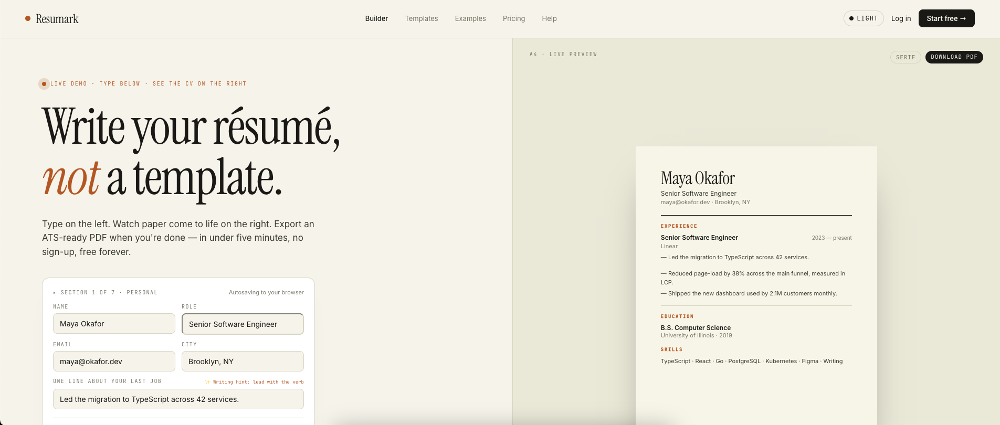
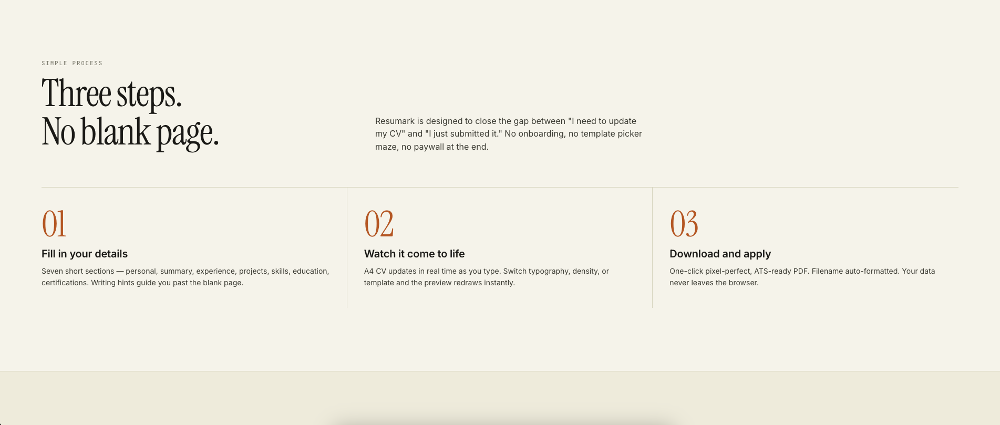
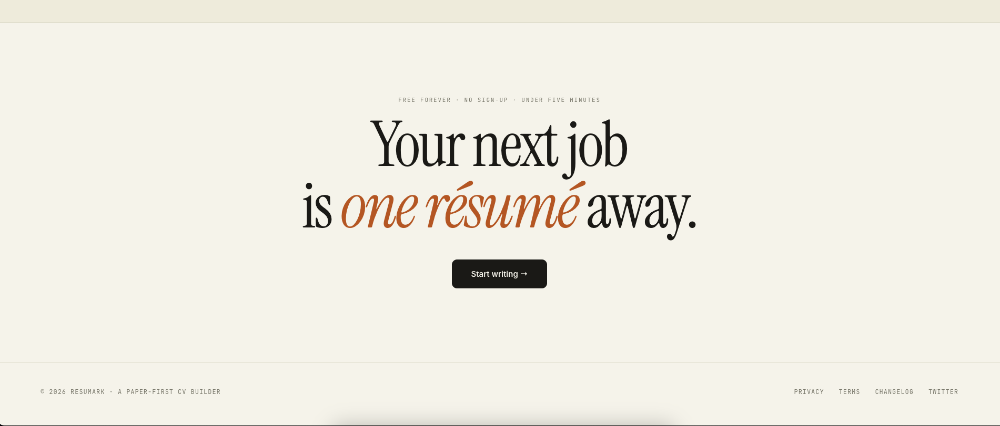
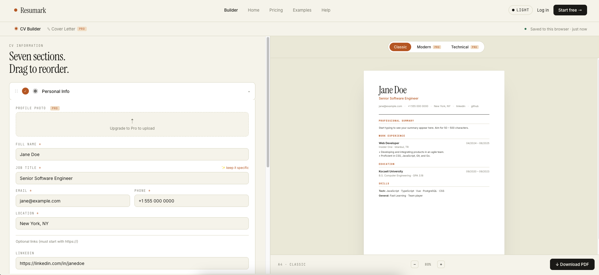
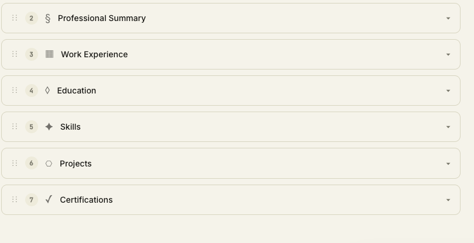
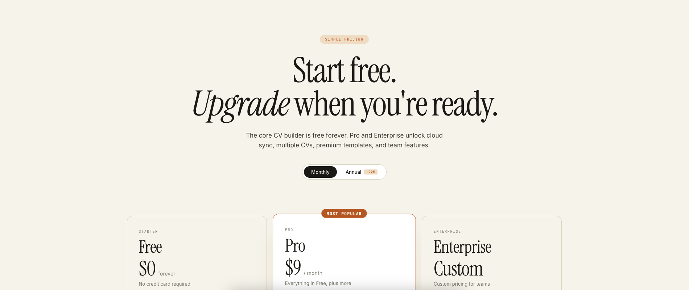
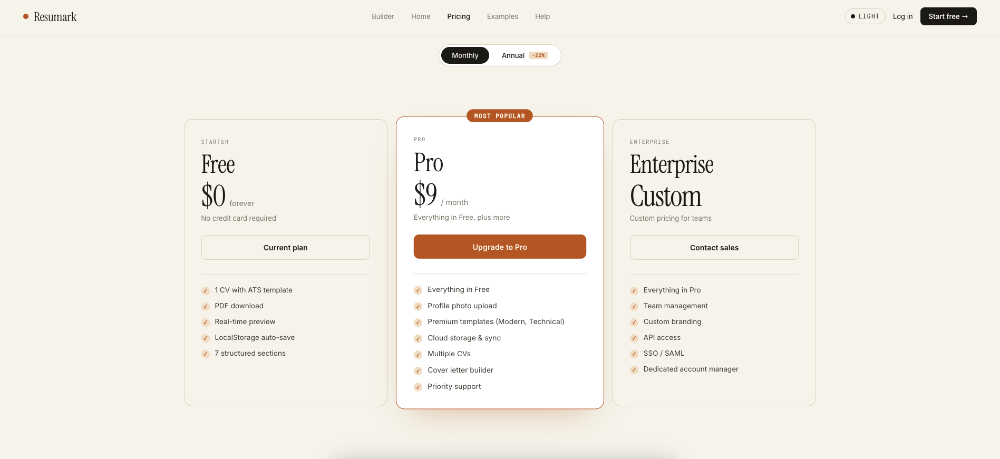

# Resumark — Design Reproduction Prompt

Build a multi-page web design for **Resumark**, a professional CV builder. Deliver three HTML files that share one design system: a homepage (`index.html`), a split-screen CV editor (`builder.html`), and a pricing page (`pricing.html`). Every page must support a **light/dark toggle** that swaps a paper-and-ink palette for a near-black palette, persisted via the theme-vars pattern described below.

---

## Tech Stack

| Layer | Choice | Reason |
|---|---|---|
| **Framework** | Vue 3 (Composition API, `<script setup>`) | Reactive primitives map cleanly to form↔preview binding |
| **Language** | TypeScript (strict mode, zero `any`) | Catches interface mismatches early; all CV data is fully typed |
| **State** | Pinia | Lightweight, devtools-friendly; stores form data and UI state separately |
| **Styling** | TailwindCSS v3 + scoped CSS | Utilities for layout/spacing; scoped `@keyframes` for animations |
| **PDF** | html2pdf.js (lazy-loaded) | html2canvas renders the live DOM; jsPDF converts to A4 |
| **Build** | Vite 8 | Sub-second HMR; tree-shaking keeps html2pdf.js in its own async chunk |
| **Router** | Vue Router 4 | Hash-free history routes; route guard stub for future `/dashboard` |
| **Fonts** | Instrument Serif (display) · DM Sans (UI) · Inter (CV) · JetBrains Mono (labels) | Google Fonts; Inter is serif-free and highly ATS-safe |
| **Lint / Format** | ESLint + Prettier | Enforces `no-any`, unused vars, and consistent style |

---

## Styling conventions

- **Theme tokens are CSS custom properties** declared in `assets/main.css` under `:root` (light) and `:root[data-theme="dark"]` (dark). `useTheme` composable toggles `document.documentElement.dataset.theme`.
- **Tailwind** handles layout, spacing, flex/grid. Colors come from `theme.extend.colors` which maps to `var(--demo-bg)`, `var(--accent)`, etc. — so utilities like `bg-paper text-ink border-rule` resolve to tokens and respect dark mode automatically.
- **Scoped `<style>` blocks** carry anything utility-hostile: keyframes, `::placeholder`, focus-within chains, `color-mix()` gradients.
- **Inline styles** only on the `<article id="cv-preview">` element — html2canvas serialises inline styles reliably, class-based styles can diverge at capture time.
- **No `any`**. All CV data flows through interfaces in `types/cv.types.ts`; use `unknown` + type guards where the shape is truly dynamic.

---

## Design system

### Palette — light (default)

| Token | Value | Usage |
|---|---|---|
| `--demo-bg` | `#F6F2EA` | Paper background |
| `--demo-bg-2` | `#EFE9DB` | Secondary surfaces |
| `--demo-card-bg` | `#FFFFFF` | Cards |
| `--demo-preview-bg` | `#ECE6D7` | CV preview wash |
| `--demo-fg` | `#1A1916` | Ink |
| `--demo-fg-2` | `#3B3932` | Body text |
| `--demo-muted` | `#7A766B` | Labels, meta |
| `--demo-rule` | `#D9D2C1` | 1px dividers |
| `--accent` | `#B8532A` | **Sienna** — single accent |
| `--accent-soft` | `#F3D9C4` | Accent-tinted backgrounds |
| `--ok` | `#2F6B4F` | Save/success indicator |

### Palette — dark

| Token | Value |
|---|---|
| `--demo-bg` | `#1A1916` |
| `--demo-bg-2` | `#141310` |
| `--demo-card-bg` | `#211F1B` |
| `--demo-preview-bg` | `#0F0E0C` |
| `--demo-fg` | `#F6F2EA` |
| `--demo-fg-2` | `#C5BEB0` |
| `--demo-muted` | `#8A8478` |
| `--demo-rule` | `#2F2D28` |
| `--accent` | `#D97E4F` (warmer sienna) |
| `--accent-soft` | `#3A241A` |

### Typography (Google Fonts)

Load all four via `<link>` in `index.html`. Expose as Tailwind font families: `font-display` / `font-sans` / `font-cv` / `font-mono`.

- **Instrument Serif** (`font-display`) — display only. `font-weight: 400`, `letter-spacing: -0.02em to -0.03em`, `line-height: 0.95–1.08`. Use italic for emphasis words inside headlines. Display sizes: **56px / 72px / 96px / 120px**. Always add `padding-bottom: 4px` under large serif headings so descenders clear.
- **DM Sans** (`font-sans`) 400/500/600/700 — all UI chrome: nav, buttons, form inputs, body copy outside the CV document. 13–17px.
- **Inter** (`font-cv`) 400/500/600/700 — **only** inside `CVPreview.vue` and the mini-CVs. Serif-free and highly ATS-safe; this is the font that ends up in the downloaded PDF.
- **JetBrains Mono** (`font-mono`) 400/500 — eyebrows, labels, stats, meta. Always `text-transform: uppercase` + `letter-spacing: 0.14em–0.18em`, size 9–11px.

### Voice

Professional & trustworthy. Editorial — "A résumé worth reading," "Write your résumé, not a template," "From blank to submitted." Italicize one emotive word per headline (colored in accent sienna).

---

## Homepage (`HomeView.vue`)

Top-level **tab switcher** with three pills ("Critique / Variations / Prototype") in the topbar. Persists to localStorage.

### 1. Prototype tab — full redesigned homepage

**Nav:** sienna dot + "Resumark" serif wordmark, center nav links (Builder/Templates/Examples/Pricing/Help), right side has a Light/Dark pill toggle, Log in, and primary "Start free →" button using fg/bg swap.

**Hero** — split `minmax(520px, 1.05fr) / minmax(420px, 1fr)`.

- Left: pulsing sienna dot + mono "Live demo" eyebrow → 96px serif `Write your résumé, / not a template.` (italic `not` in accent) → lede → **mini-demo card**: 4 fields (Name/Role/Email/City) + "One line about your last job" with ✨ writing hint, 7-dot progress bar, "Continue building →" button. Typing updates the preview live. Below: 3 editorial stats `04:12 / 100% / $0` (serif 38px + mono label).
- Right panel: preview-wash bg, "A4 · Live preview" and "Download PDF" chips, live `<LiveCV />` matching the reference CV layout — sections use mono sienna uppercase headings with `letter-spacing: 0.18em`.

**How it works** — two-column header (left: eyebrow + 72px serif "Three steps. / No blank page."), three-column steps divided by 1px rules with huge sienna serif numerals `01 02 03`.

**Testimonials** — 2×2 grid, 26px italic serif quotes, attribution with role + hire outcome + relative time.

**Closing CTA** — 120px serif "Your next job / is *one résumé* away."

Footer in mono, 12px.

---

## Builder (`BuilderView.vue`)

Reuses `ResumarkNav` with `active="builder"`. Below nav: sub-nav row (◉ CV Builder / ✎ Cover Letter PRO) + right-side "Saved to this browser · just now" status with a green dot.

Grid `minmax(420px, 45%) / 1fr`, full-height, both sides independently scrollable.

### Left — editor

Mono eyebrow "CV Information" + serif 38px "Seven sections. / Drag to reorder." Then seven accordion headers:

1. Personal Info
2. Professional Summary
3. Work Experience
4. Education
5. Skills
6. Projects
7. Certifications

Each header: drag handle `⋮⋮`, a 22px circle (filled sienna with ✓ when complete, otherwise shows step number), a decorative glyph (`◉ § ▦ ◊ ✦ ⎔ ✓`), label, caret. Open section expands into a card. **Personal Info** includes: Pro-gated photo upload zone (dashed border), then Name / Job Title / Email + Phone / Location in a 2-col grid, then a rule with "Optional links" sub-label and LinkedIn / GitHub / Website. All fields use mono uppercase labels, rounded inputs that outline in sienna on focus.

### Right — preview

Preview-wash bg, top template-switcher pill (Classic / Modern PRO / Technical PRO — active uses sienna fill, others transparent). Scroll area contains the live `<CVDoc>` — a 560px × 792px+ white A4 with:

- Serif 40px name
- Sienna role
- Mono contact line
- 1px black separator
- Professional Summary / Work Experience / Education / Skills sections with mono sienna letter-spaced headings and 1px `#D9D2C1` rules

**Bottom toolbar:** `A4 · <template>` mono label, zoom −/+ stepper (50–140%), and primary "↓ Download PDF" button. Toolbar uses `flexWrap: wrap` so it survives narrow viewports.

---

## Pricing (`PricingView.vue`)

Reuses `ResumarkNav` with `active="pricing"`.

### Hero

Centered: sienna pill eyebrow "Simple pricing", 96px serif "Start free. / *Upgrade* when you're ready." (italic `Upgrade` in sienna), lede, then Monthly/Annual segmented toggle with a `−22%` accent chip on Annual.

### Plans

3-column grid, 20px gap, `align-items: stretch`. Each card:

- Mono eyebrow (Starter / Pro / Enterprise)
- 48px serif name
- 56px serif price (`$0 forever` / `$9 / month` / `Custom`)
- Subtitle
- Full-width CTA
- 1px rule
- Feature list with 16px circular sienna-soft checkmark bullets

**Pro card** is highlighted: sienna border, `scale(1.02)`, sienna drop shadow, and a "Most popular" badge pill floating at `top: -14px` — **must have `white-space: nowrap`**.

### Comparison table

On `demo-section-bg`: 4-column grid (Feature / Free / Pro / Enterprise), 15 rows, Pro column has a faint `color-mix(in oklab, var(--accent) 5%, transparent)` tint, alternating row backgrounds, ✓ in sienna / em-dash in muted.

### FAQ

1fr / 1.5fr split. Left: mono eyebrow + 56px serif "*Frequently* / asked." + contact line. Right: 6 FAQ items separated by rules, serif 22px questions, `+` icon rotates 45° to `×` when open.

### Closing CTA

Same pattern as homepage: mono eyebrow + 96px serif with italic sienna phrase, then a dark primary button.

---

## PDF export pipeline (`usePDFExport.ts`)

Five must-dos for screen-to-PDF fidelity:

1. **Neutralise ancestor transforms.** The A4 preview is `scale()`d to fit the panel; html2canvas includes that in its render context. Walk up the DOM, record every transformed ancestor's inline transform, set to `none`, restore in `finally`.
2. **Zero margin on html2pdf** (`margin: [0,0,0,0]`). The CV's own `padding: 40px` provides all whitespace — stacking html2pdf margin on top compresses the content area.
3. **`await document.fonts.ready`** before capture. Inter loads async from Google Fonts.
4. **`scrollX: 0, scrollY: 0`** passed to html2canvas + manual `.scrollTop = 0` on the preview container prevent cropping.
5. **No `overflow: hidden`** on `<article id="cv-preview">`. Use `min-height: 1123px` (A4 at 96dpi), never `max-height`.

Lazy-import html2pdf.js inside the export function so it stays in its own async chunk.

---

## Non-negotiables for exact reproduction

- Single sienna accent — **no other colors**. Never teal, never gradients.
- Paper bg `#F6F2EA` (not white) in light mode.
- Instrument Serif for display; DM Sans for UI chrome; Inter for CV content only; JetBrains Mono **only** as eyebrows/labels with uppercase + wide tracking.
- Italic + sienna color on one emphasis word per major headline.
- Every section eyebrow is 10–11px JetBrains Mono, uppercase, `letter-spacing: 0.16–0.18em`.
- 1px rules (`var(--demo-rule)`) separate sections — no boxy card containers for layout.
- Mini-CV preview uses real paper (`#FFFFFF`) even in dark mode, with `box-shadow: 0 30px 60px -30px rgba(26,25,22,0.25)`.
- **No emoji.** No stock iconography. Placeholder glyphs only (`◉ § ▦ ◊ ✦ ⎔ ✓ ✎ ⋮⋮`).
- Large serif headlines need `padding-bottom: 4px` and `line-height ≥ 1` to avoid descender clipping.
- Toolbars and grids use `flex-wrap` / `minmax()` so nothing clips at narrow widths.
- Strict TypeScript — no `any`. All CV data flows through `types/cv.types.ts`.
- Inline styles allowed **only** on `<article id="cv-preview">` for html2canvas reliability. Everywhere else: Tailwind utilities mapped to theme tokens + scoped `<style>`.
